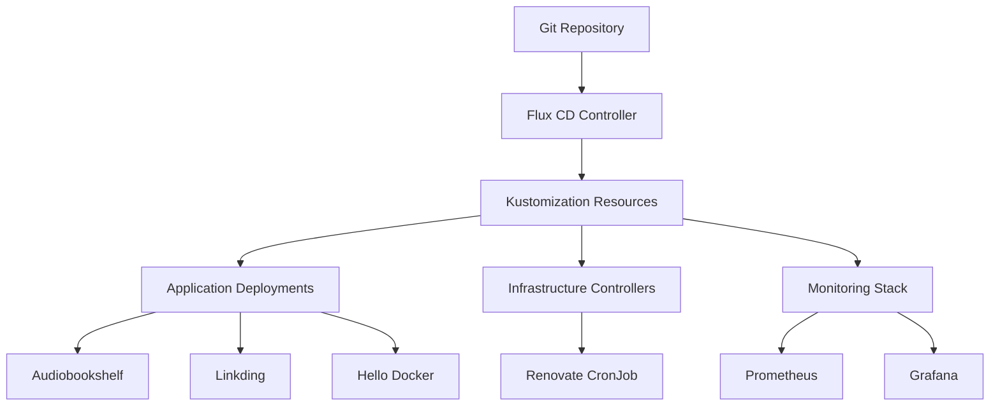
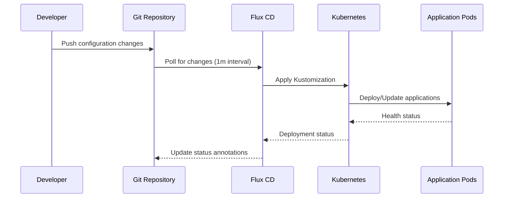

# Raspberry Pi Kubernetes Cluster

This is my home GitOps-managed Kubernetes cluster running on Raspberry Pi hardware, featuring self-hosted applications, monitoring, and automated dependency management.

## 🏗️ Architecture Overview

The architecture follows the GitOps pattern where the desired state is defined in Git and automatically synchronized to the cluster.

## 🛠️ Technologies Used

### Core Infrastructure
- **Kubernetes**: Container orchestration platform
- **Flux CD**: GitOps operator for continuous deployment
- **Kustomize**: Configuration management and templating
- **Helm**: Package manager for Kubernetes applications

### Applications
- **Audiobookshelf** (`ghcr.io/advplyr/audiobookshelf:2.29.0`): Self-hosted audiobook and e-book server
- **Linkding** (`sissbruecker/linkding:1.43.0`): Self-hosted bookmark manager
- **Hello Docker** (`vitalyguzun/hello-world:latest`): Test application for experiments

### Networking & Security
- **Cloudflare Tunnel** (`cloudflare/cloudflared:latest`): Secure tunneling for external access
- **SOPS**: Secrets management with encryption

### Monitoring & Observability
- **Prometheus**: Metrics collection and storage
- **Grafana**: Metrics visualization and dashboards
- **Kube-Prometheus-Stack**: Complete monitoring solution

### Automation & Maintenance
- **Renovate** (`renovate/renovate:latest`): Automated dependency updates
- **CronJobs**: Scheduled maintenance tasks

## 📁 Project Structure

```
rasberry-pi-cluster/
├── apps/                          # Application definitions
│   ├── base/                      # Base application configurations
│   │   ├── audiobookshelf/        # Audiobookshelf app
│   │   ├── hello-docker/          # Test application
│   │   └── linkding/              # Linkding bookmark manager
│   └── staging/                   # Staging environment overrides
│       ├── audiobookshelf/        # Cloudflare tunnel config
│       ├── hello-docker/          # Staging overrides
│       └── linkding/              # Ingress and tunnel config
├── clusters/                      # Cluster-specific configurations
│   └── staging/                   # Staging cluster config
│       ├── apps.yaml              # Application deployments
│       ├── infrastructure.yaml    # Infrastructure controllers
│       ├── monitoring.yaml        # Monitoring stack
│       └── flux-system/           # Flux CD system components
├── infrastructure/                # Infrastructure controllers
│   └── controllers/
│       ├── base/                  # Base infrastructure
│       └── staging/               # Staging overrides
├── monitoring/                    # Monitoring configurations
│   ├── configs/                   # Monitoring configs
│   └── controllers/               # Monitoring controllers
└── temp/                          # Temporary files
```

## 🔄 GitOps Workflow

The project follows a GitOps workflow where:

1. **Configuration as Code**: All cluster configurations are stored in Git
2. **Automated Sync**: Flux CD continuously monitors the Git repository
3. **Declarative State**: Desired state is defined in YAML manifests
4. **Automated Deployment**: Changes are automatically applied to the cluster

## 🚀 Deployment Process

### 1. Cluster Bootstrap


### 2. Application Deployment Flow


## 🔧 Key Features

### Security
- **Non-root containers**: All applications run with specific user IDs
- **Security contexts**: Restricted privilege escalation
- **Encrypted secrets**: SOPS encryption for sensitive data
- **TLS termination**: Secure communication with Cloudflare

### High Availability
- **Multiple replicas**: Cloudflare tunnel runs with 2 replicas
- **Health checks**: Liveness and readiness probes
- **Persistent storage**: PVCs for data persistence

### Monitoring
- **Comprehensive metrics**: Prometheus collects cluster and application metrics
- **Visualization**: Grafana dashboards for monitoring
- **Alerting**: Built-in alerting rules for critical issues

### Automation
- **Dependency updates**: Renovate automatically updates container images
- **GitOps sync**: Automatic deployment of configuration changes
- **Scheduled maintenance**: CronJob-based maintenance tasks
