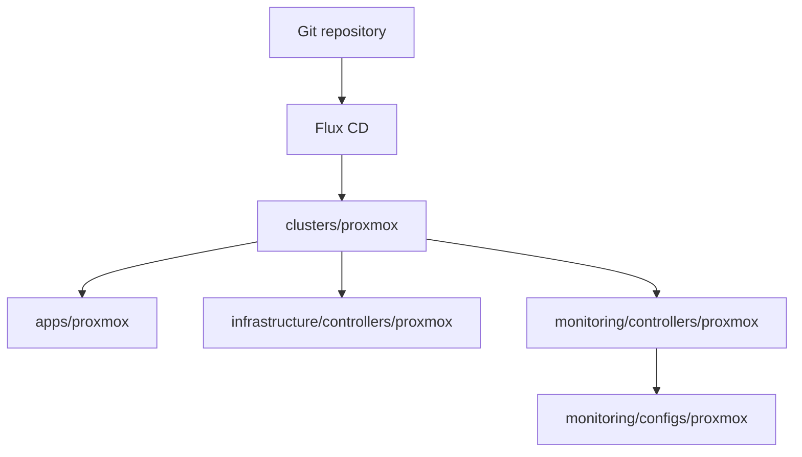

# Proxmox Kubernetes Cluster

GitOps configuration for a self-hosted Kubernetes cluster running on Proxmox.
Flux continuously reconciles the desired state from the `main` branch.

## Stack

- Kubernetes and Flux CD
- Kustomize and Helm
- SOPS with Age for encrypted secrets
- Cloudflare Tunnel for external access
- Prometheus and Grafana for monitoring
- Renovate for dependency updates

## Applications

- [Audiobookshelf](https://www.audiobookshelf.org/) — audiobook and e-book server
- [Linkding](https://linkding.link/) — bookmark manager

## Repository structure

```text
.
├── apps/
│   ├── base/                       # Reusable application manifests
│   └── proxmox/                    # Proxmox application overlays
├── clusters/
│   └── proxmox/                    # Flux entry point for the cluster
├── infrastructure/
│   └── controllers/
│       ├── base/                   # Reusable infrastructure manifests
│       └── proxmox/                # Proxmox infrastructure overlay
├── monitoring/
│   ├── configs/
│   │   └── proxmox/                # Monitoring configuration
│   └── controllers/
│       ├── base/                   # Monitoring Helm sources and releases
│       └── proxmox/                # Proxmox monitoring overlay
└── renovate.json
```

## Reconciliation flow


```mermaid
flowchart TD
    Git["Git repository"] --> Flux["Flux CD"]
    Flux --> Cluster["clusters/proxmox"]
    Cluster --> Apps["apps/proxmox"]
    Cluster --> Infrastructure["infrastructure/controllers/proxmox"]
    Cluster --> MonitoringControllers["monitoring/controllers/proxmox"]
    MonitoringControllers --> MonitoringConfigs["monitoring/configs/proxmox"]
```

The root Flux Kustomization is defined in
`clusters/proxmox/flux-system/gotk-sync.yaml`. It reconciles
`clusters/proxmox`, which in turn manages applications, infrastructure, and
monitoring.

## Secrets

Secrets committed to the repository are encrypted with SOPS. Flux decrypts
them in the cluster using the `sops-age` secret in the `flux-system`
namespace.

Do not commit unencrypted credentials, private keys, local `.env` files, or
generated TLS files.

## Bootstrap

Bootstrap Flux against the Proxmox cluster and this repository:

```shell
flux bootstrap github \
  --owner=vitaly-guzun \
  --repository=raspberry-pi-cluster \
  --branch=main \
  --path=clusters/proxmox \
  --personal
```

Before bootstrapping, make sure the target Kubernetes context is selected and
the SOPS Age key is available to Flux as `flux-system/sops-age`.

## Validation

Render the cluster configuration locally:

```shell
kubectl kustomize clusters/proxmox
kubectl kustomize apps/proxmox
kubectl kustomize infrastructure/controllers/proxmox
kubectl kustomize monitoring/controllers/proxmox
kubectl kustomize monitoring/configs/proxmox
```
