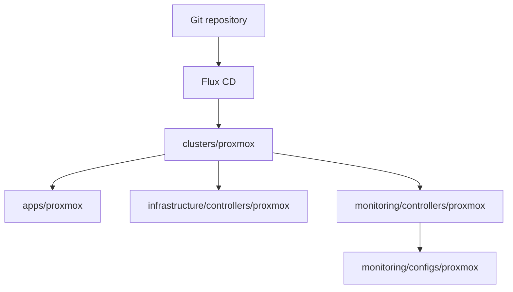
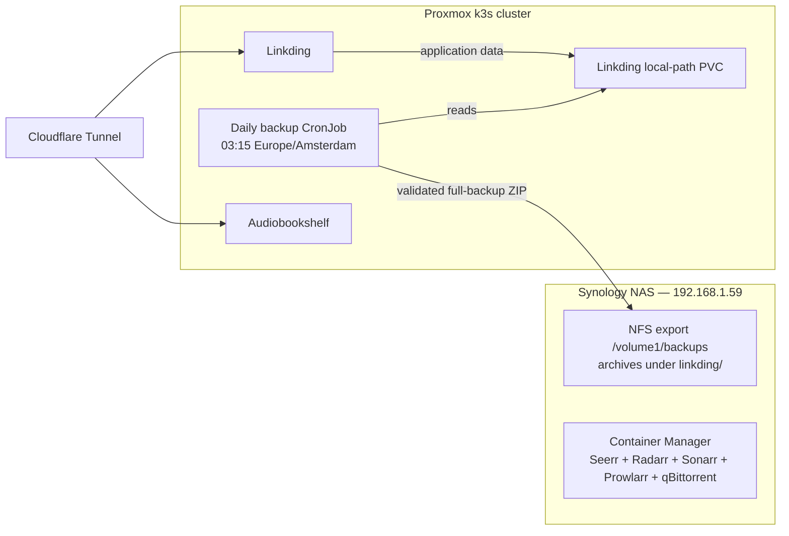

# Proxmox Kubernetes Cluster

GitOps configuration for a self-hosted Kubernetes cluster running on Proxmox.
Flux continuously reconciles the desired state from the `main` branch.

## Stack

- Kubernetes and Flux CD
- Kustomize and Helm
- SOPS with Age for encrypted secrets
- Cloudflare Tunnel for external access
- Prometheus and Grafana for monitoring
- Renovate for dependency updates
- Synology NAS for NFS backups and media storage

## Applications

- [Audiobookshelf](https://www.audiobookshelf.org/) — audiobook and e-book server
- [Linkding](https://linkding.link/) — bookmark manager
- [Linkding backups](apps/proxmox/linkding/BACKUP.md) — daily full backups to
  Synology over NFS
- [Mealie](https://mealie.io/) — recipe manager and meal-planning trial; see the
  [first-week runbook](apps/proxmox/mealie/README.md)
- [Synology media automation](synology/media-automation/README.md) — Seerr,
  Radarr, Sonarr, Prowlarr, and qBittorrent project for media requests and
  imports

## Repository structure

```text
.
├── apps/
│   ├── base/                       # Reusable application manifests
│   └── proxmox/                    # Proxmox application overlays
│       ├── audiobookshelf/
│       ├── linkding/               # Linkding overlay and backup CronJob
│       └── mealie/                 # Initial recipe and meal-planning trial
├── clusters/
│   └── proxmox/                    # Flux entry point for the cluster
├── infrastructure/
│   └── controllers/
│       ├── base/                   # Reusable infrastructure manifests
│       └── proxmox/                # Proxmox infrastructure overlay
├── monitoring/
│   ├── configs/
│   │   └── proxmox/                # Monitoring configuration
│   └── controllers/
│       ├── base/                   # Monitoring Helm sources and releases
│       └── proxmox/                # Proxmox monitoring overlay
├── synology/
│   └── media-automation/           # Automated movie and series requests
└── renovate.json
```

## Reconciliation flow


```mermaid
flowchart TD
    Git["Git repository"] --> Flux["Flux CD"]
    Flux --> Cluster["clusters/proxmox"]
    Cluster --> Apps["apps/proxmox"]
    Cluster --> Infrastructure["infrastructure/controllers/proxmox"]
    Cluster --> MonitoringControllers["monitoring/controllers/proxmox"]
    MonitoringControllers --> MonitoringConfigs["monitoring/configs/proxmox"]
```

The root Flux Kustomization is defined in
`clusters/proxmox/flux-system/gotk-sync.yaml`. It reconciles
`clusters/proxmox`, which in turn manages applications, infrastructure, and
monitoring.

## Runtime architecture


```mermaid
flowchart LR
    Cloudflare["Cloudflare Tunnel"]

    subgraph K3s["Proxmox k3s cluster"]
        Linkding["Linkding"] -->|"application data"| LinkdingPVC["Linkding local-path PVC"]
        Backup["Daily backup CronJob<br/>03:15 Europe/Amsterdam"] -->|"reads"| LinkdingPVC
        Audiobookshelf["Audiobookshelf"]
    end

    subgraph NAS["Synology NAS — 192.168.1.59"]
        NFS["NFS export /volume1/backups<br/>archives under linkding/"]
        Media["Container Manager<br/>Seerr + Radarr + Sonarr + Prowlarr + qBittorrent"]
    end

    Cloudflare --> Linkding
    Cloudflare --> Audiobookshelf
    Backup -->|"validated full-backup ZIP"| NFS
```

Linkding's application data is stored on a `local-path` `ReadWriteOnce` PVC.
The backup Pod uses pod affinity to run on the same Kubernetes node as Linkding,
then writes the resulting archive to the Synology NFS export. Synology media
automation is a separate Compose workload managed through Container Manager;
it is not reconciled by Flux. Seerr is its end-user request UI, while Radarr,
Sonarr, Prowlarr, and qBittorrent remain administrative interfaces.

## Linkding backups

The `linkding-backup` CronJob runs every day at 03:15 in the
`Europe/Amsterdam` time zone. It uses Linkding's transaction-safe
`full_backup` command, which includes the SQLite database, bookmark assets,
favicons, and preview images. The job validates the ZIP locally before copying
it to:

```text
/volume1/backups/linkding/linkding-YYYY-MM-DDTHH-MM-SSZ.zip
```

The final filename only appears after the NFS copy completes. Old backups are
not deleted by Kubernetes; retention and snapshots should be configured on
Synology. Every Kubernetes node that can run Linkding must have `nfs-common`
installed and must be allowed by the Synology NFS rule. See the
[backup runbook](apps/proxmox/linkding/BACKUP.md) for preparation, manual test,
and restore instructions.

## Secrets

Secrets committed to the repository are encrypted with SOPS. Flux decrypts
them in the cluster using the `sops-age` secret in the `flux-system`
namespace.

Do not commit unencrypted credentials, private keys, local `.env` files, or
generated TLS files.

## Bootstrap

Bootstrap Flux against the Proxmox cluster and this repository:

```shell
flux bootstrap github \
  --owner=vitaly-guzun \
  --repository=raspberry-pi-cluster \
  --branch=main \
  --path=clusters/proxmox \
  --personal
```

Before bootstrapping, make sure the target Kubernetes context is selected and
the SOPS Age key is available to Flux as `flux-system/sops-age`.

## Validation

Render the cluster configuration locally:

```shell
kubectl kustomize clusters/proxmox
kubectl kustomize apps/proxmox
kubectl kustomize infrastructure/controllers/proxmox
kubectl kustomize monitoring/controllers/proxmox
kubectl kustomize monitoring/configs/proxmox
```
